# PZT-4 Piezoelectric PINN Solver — Architecture Overview

Solves a **semi-infinite PZT-4 piezoelectric strip with a central crack** subjected to a
thermal step load governed by the **fractional Cattaneo–Vernotte heat equation** (Caputo
order γ = 0.8).  The solver couples a finite-difference temperature pre-solve with a
Physics-Informed Neural Network for the quasi-static piezoelectric mechanics.

---

## Pipeline Diagram

```mermaid
flowchart TD
    classDef cfg   fill:#dae8fc,stroke:#6c8ebf,color:#000
    classDef fdm   fill:#d5e8d4,stroke:#82b366,color:#000
    classDef nn    fill:#fff2cc,stroke:#d6b656,color:#000
    classDef train fill:#ede7f6,stroke:#7e57c2,color:#000
    classDef out   fill:#f8cecc,stroke:#b85450,color:#000

    CFG["config.py
    PZT-4 elastic / piezo / dielectric constants
    Geometry: H=4m, a=1m, b=3m, L=10m
    Fractional model: gamma=0.8, tau_q=0.4s
    Hyper-params: Adam 15k, L-BFGS 5k, w_BC=10"]:::cfg

    CFG -->|"lambda0, gamma, tau_q, H, T_max"| TEMP
    CFG -->|"muE0, kE0"| TL
    CFG -->|"material constants"| PDE

    TEMP["temperature.py
    1-D fractional Cattaneo-Vernotte PDE
    d2T/dx3^2 = 1/lambda0 x dT/dt + Cgamma x D^1+gamma T
    Method: Grunwald-Letnikov + IMEX Crank-Nicolson
    Banded tridiagonal solve at each time step
    Output: T(x3,t)  shape Nx x Nt"]:::fdm

    TEMP -->|"T(x3,t) field"| TL

    TL["thermal_loading.py
    Trapezoidal integrals I1 = int T dx3,  I2 = int x3*T dx3
    Solve 2x2 system for A(t), B(t) at every time step
    tau0(x3,t) = muE0*(A*x3 + B) - kE0*T
    RegularGridInterpolator gives tau0_fn callable"]:::fdm

    TL -->|"tau0_fn"| BC

    NET["network.py  --  MechanicsNet
    Architecture: FCBlock 3-128-128-128-128-3
    Activation: Tanh   Init: Xavier-uniform   dtype: float64
    Inputs : x1, x3, t  normalised to 0..1
    Outputs: u1, u3, phi  scaled by U_REF / PHI_REF"]:::nn

    PDE["pde_residuals.py
    Autograd second-order derivatives  create_graph=True
    R1: u1-momentum  (mu11+s11)*u1_x1x1 + (mu44+s33)*u1_x3x3 + ...
    R2: u3-momentum  (mu44+s11)*u3_x1x1 + (mu33+s33)*u3_x3x3 + ...
    R3: Gauss-piezo  e15*u3_x1x1 + e33*u3_x3x3 - eps11*phi_x1x1 - ..."]:::nn

    BC["boundary_conditions.py
    BC1  crack face a to b :  tau11 = -tau0_static - tau0_thermal
    BC2  non-crack x1=0   :  u1 = 0
    BC3  left face x1=0   :  tau13 = 0
    BC4  left face x1=0   :  D1 = 0
    BC5  top and bottom   :  tau13 = tau33 = D3 = 0
    BC_far  x1 = L        :  u1, u3, phi = 0"]:::nn

    LOSS["loss.py
    L = w_PDE x mean(R1^2 + R2^2 + R3^2)
      + w_BC  x mean(BC1^2 + BC2^2 + BC3^2 + BC4^2 + BC5^2)
      + w_far x mean(u1^2 + u3^2 + phi^2) at far field
    8000 interior collocation pts, 1500 pts per boundary"]:::nn

    NET --> PDE --> LOSS
    NET --> BC  --> LOSS

    TR["trainer.py
    Phase 1 - Adam    15000 iterations,  lr = 1e-3
    Phase 2 - L-BFGS   5000 iterations,  strong_wolfe line search
    Logs every 500 steps
    Saves checkpoint to checkpoints/model.pt"]:::train

    LOSS -->|"scalar loss + backward"| TR
    TR   -->|"weight updates"| NET

    POST["postprocess.py
    SIF: KIa = lim sqrt(2*pi*delta) * tau11 as x3 approaches a
         KIb = lim sqrt(2*pi*delta) * tau11 as x3 approaches b
    Autograd active inside SIF loop, linear polyfit extrapolation
    Contour plots: T, u1, u3, phi   Loss convergence curves"]:::fdm

    TR   -->|"trained net + history"| POST
    TEMP -->|"T field"| POST

    OUT["Output files
    figures/temperature_field.png
    figures/sif_vs_time.png
    figures/loss_history.png
    figures/displacement_field.png
    checkpoints/model.pt"]:::out

    POST --> OUT
```



---

## Module Reference

| File | Role | Key I/O |
|------|------|---------|
| `src/config.py` | All physical constants and hyper-parameters | — |
| `src/temperature.py` | FD solver for fractional CV PDE | → `T(x₃,t)` array |
| `src/thermal_loading.py` | Equilibrium solve for A(t), B(t), τ₀ | → `τ₀_fn` callable |
| `src/network.py` | `MechanicsNet` + `FCBlock` architectures | `(x₁,x₃,t)` → `(u₁,u₃,φ)` |
| `src/pde_residuals.py` | Autograd PDE + constitutive residuals | → `R₁, R₂, R₃` tensors |
| `src/boundary_conditions.py` | Boundary samplers + BC residuals BC1–BC_far | → residual tensors |
| `src/loss.py` | Weighted composite PINN loss | → scalar loss + component dict |
| `src/trainer.py` | Adam → L-BFGS training loop + checkpoint I/O | → trained weights |
| `src/postprocess.py` | SIF computation and all visualisation | → `.png` files |
| `main.py` | CLI entry point, orchestrates all four steps | → figures + model |

---

## Quick-start

```bash
# install dependencies
uv sync

# full run (γ = 0.8, both optimisers)
uv run python main.py

# fast smoke-test (Adam only, coarse grids)
uv run python main.py --no-lbfgs --adam-iter 500 --nx-temp 40 --nt-temp 60

# load saved checkpoint, regenerate figures
uv run python main.py --load --checkpoint checkpoints/model.pt
```

---

## Physical Problem Summary

| Quantity | Value |
|----------|-------|
| Material | PZT-4 (transversely isotropic piezoelectric) |
| Domain | x₁ ∈ [0, 10] m · x₃ ∈ [0, 4] m |
| Crack | x₁ = 0, x₃ ∈ [1, 3] m |
| Thermal BC | T(0,t) = 1 K · H(t) (Heaviside step) |
| Heat model | Fractional Cattaneo–Vernotte, γ = 0.8, τ_q = 0.4 s |
| Output SIF | K_Ia(t), K_Ib(t) at lower / upper crack tips |
